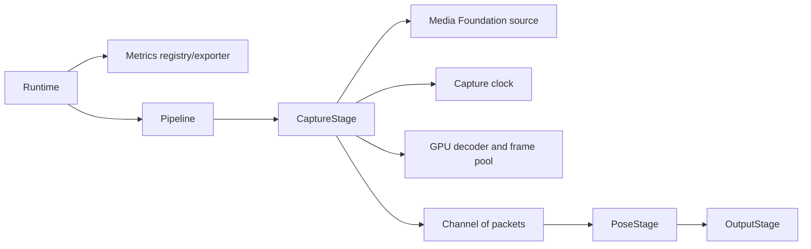

# IRIS V2 architecture

`Runtime` owns shared infrastructure and `Pipeline`; `Pipeline` owns topology; stages own domain processing only.

Shared CUDA wrappers and metrics live in `infrastructure/`. Windows capture, timing and decoding remain private below `src/stages/capture/`.
