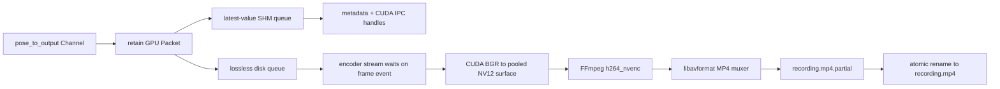

# Output stage

`OutputStage` fans retained GPU packets into independent live and recording paths. It performs no
device-to-host frame copy.

The recording queue uses blocking backpressure and never drops a frame. Each queued packet keeps
the capture frame-pool lease alive. NV12 surfaces are bounded and are returned to their pool only
when FFmpeg/NVENC releases the associated `AVBufferRef`.

The destination may be changed while idle. A change is rejected while recording, so a recording
is never silently split. `stop_recording()` stops admission, drains all accepted work, flushes
NVENC, writes the MP4 trailer, closes the file, verifies accepted-versus-muxed accounting, and
renames the partial file only on success. A failed recording retains its `.partial` file.

PTS values come from capture timestamps and must be strictly monotonic. The current checkpoint
supports one BGR8 camera frame per packet; multi-camera recording will require one MP4 video track
and encoder instance per camera.

FFmpeg is not built by this repository. CMake imports a pinned prebuilt package through
`IRIS_FFMPEG_ROOT` and copies its runtime DLL bundle beside the executables.
